# SQL_Hackerrank_Advanced_Select

## Purpose

This repository contains the solutions to HackerRank SQL Advanced SELECT questions.

## Source

- HackerRank

## SOLUTIONS

### Problem 1:

### Solution:

### Problem 2:

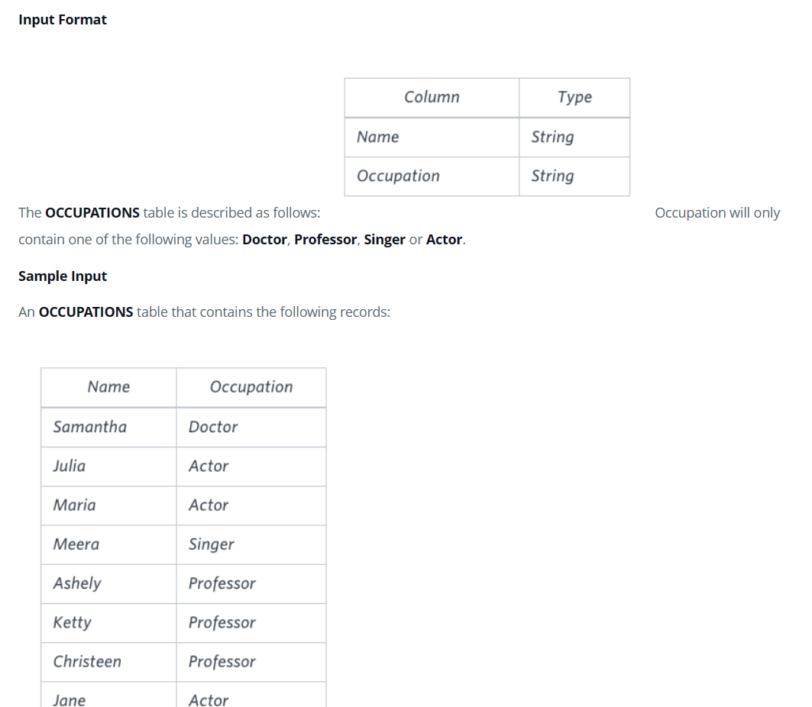

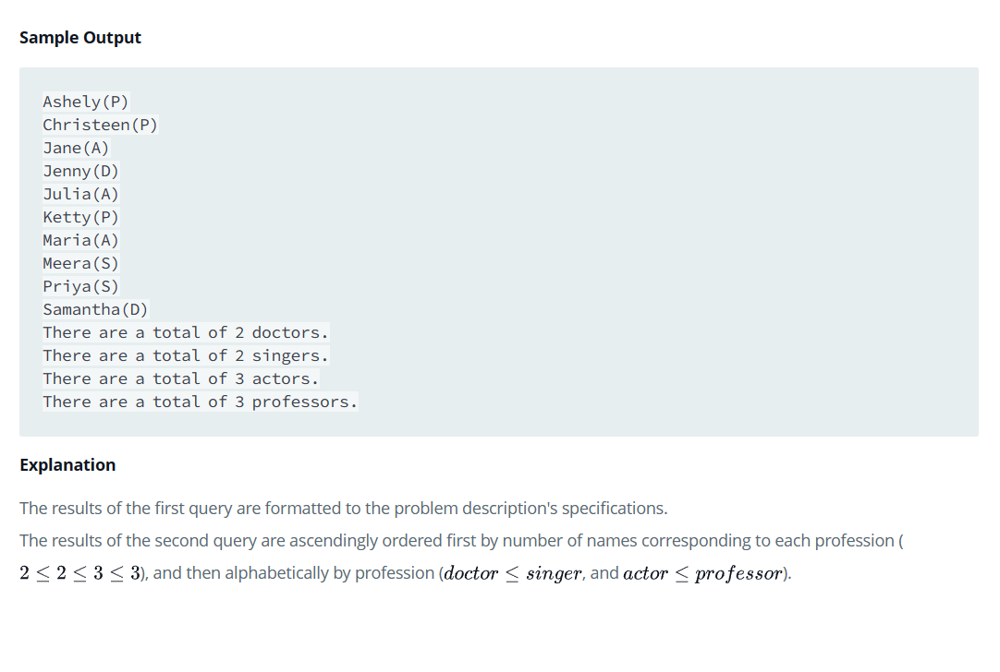

### Solution:

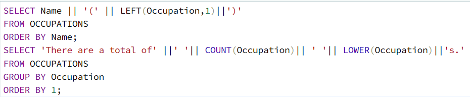

### Problem 3:

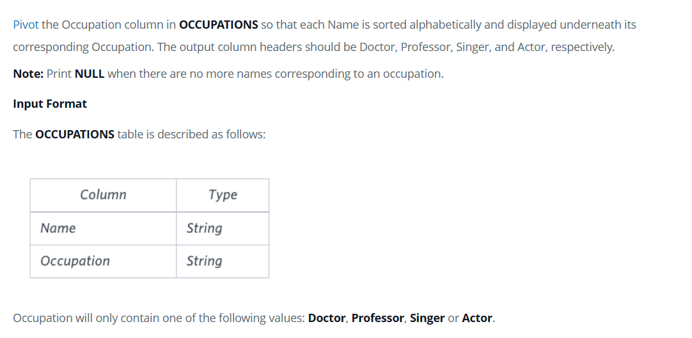

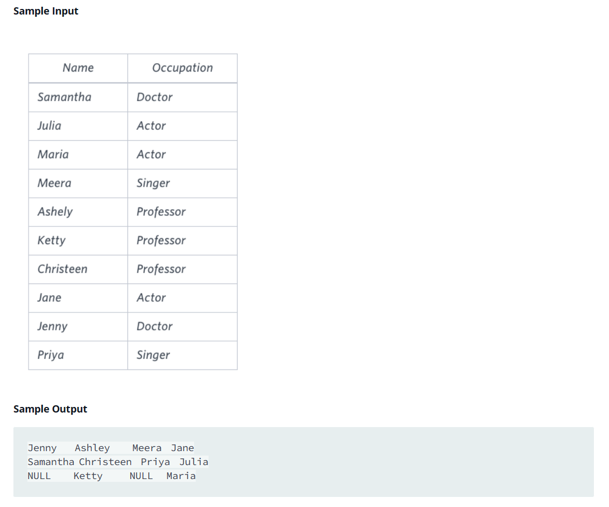

### Solution:

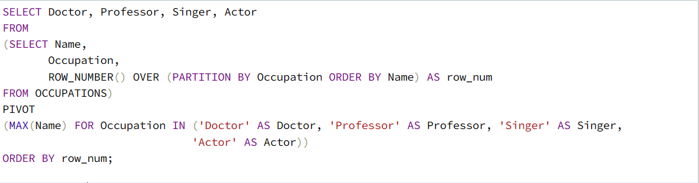

### Problem 4:

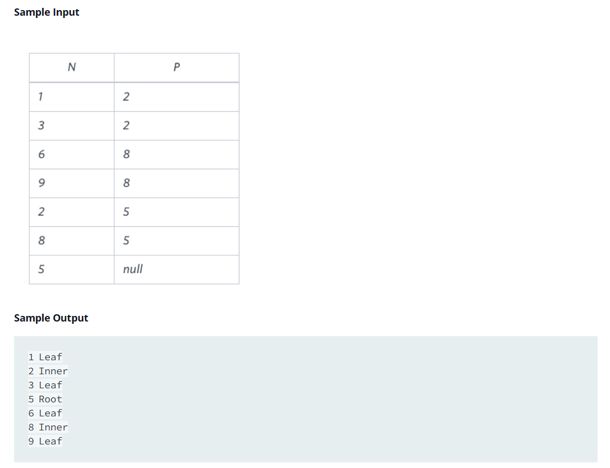

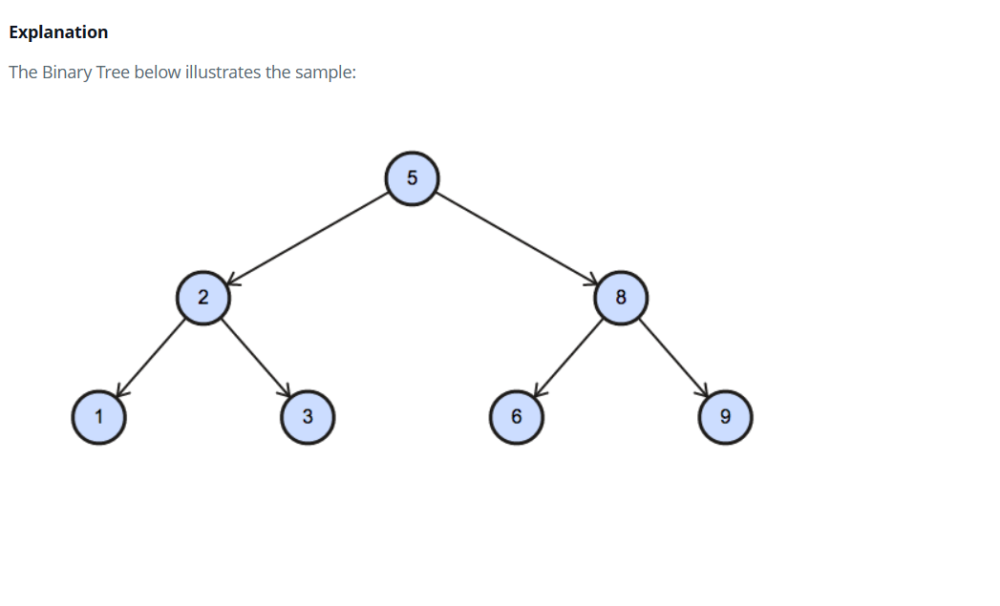

### Solution:

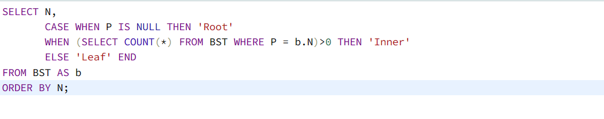

### Problem 5:

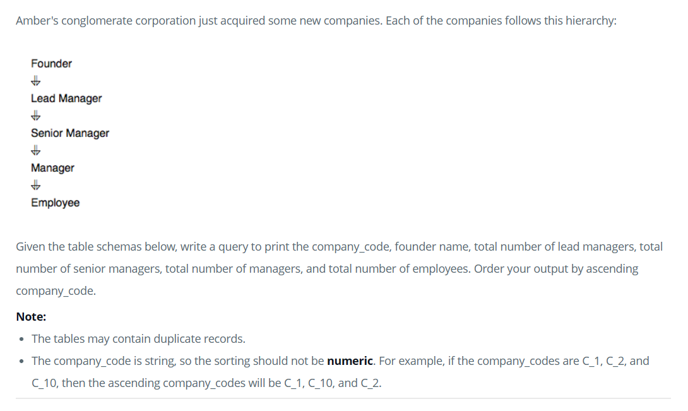

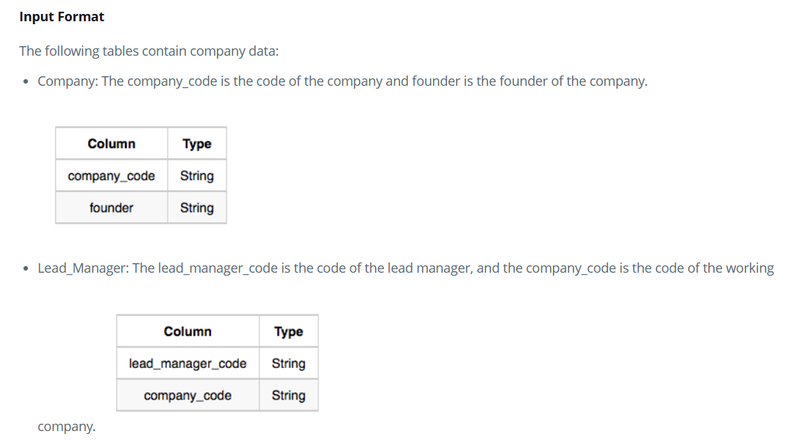

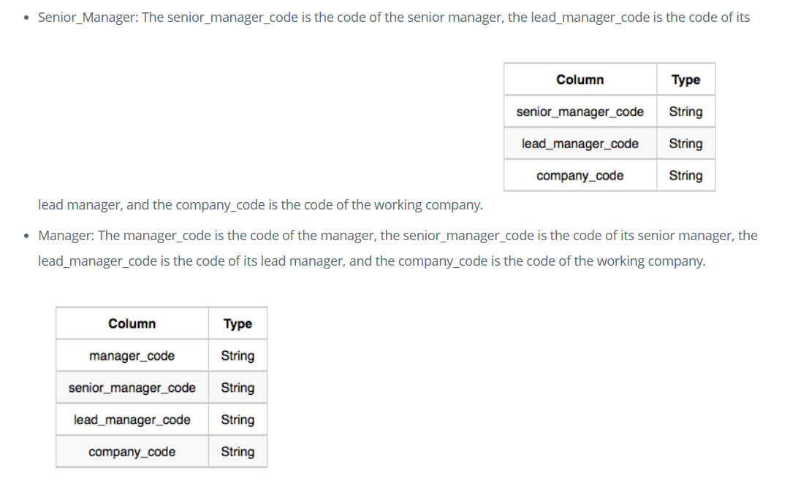

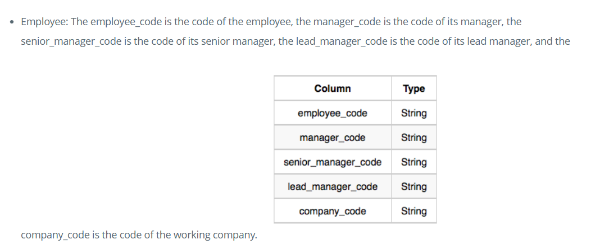

### Solution:

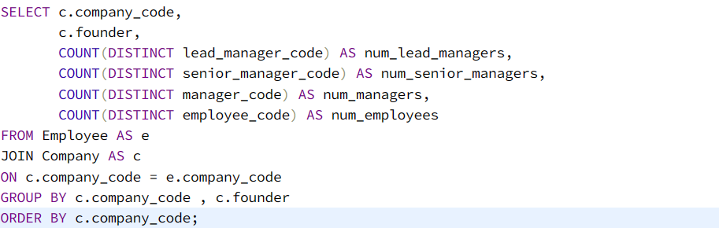

