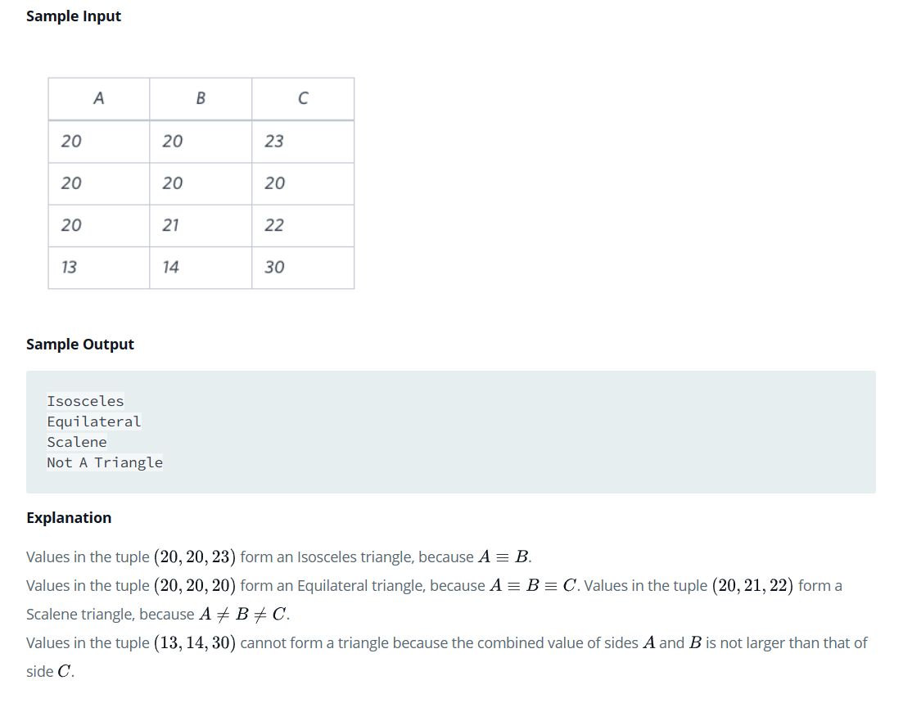
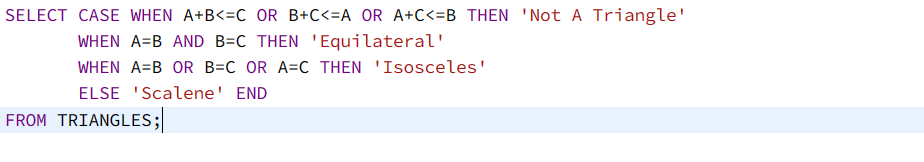
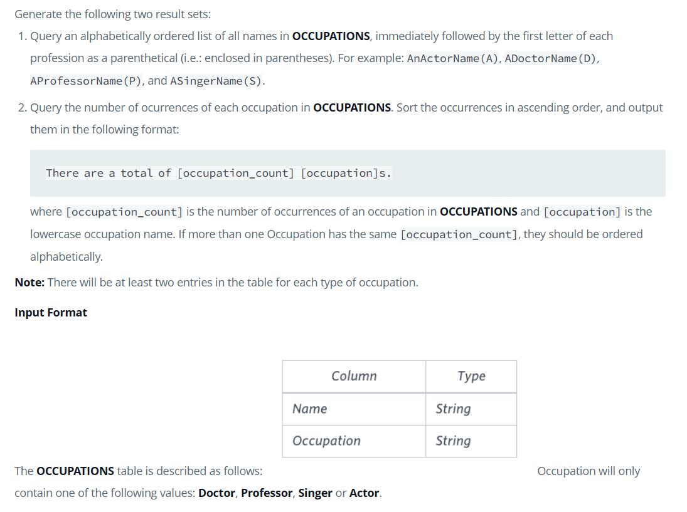
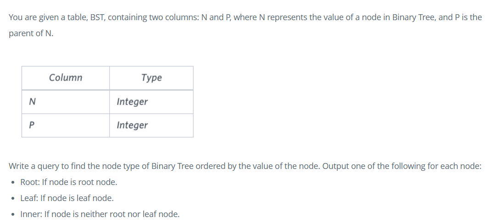

# SQL_Hackerrank_Advanced_Select

## Purpose

This repository contains the solutions to HackerRank SQL Advanced SELECT questions.

## Source

- HackerRank

## SOLUTIONS

### Problem 1:

### Solution:

### Problem 2:

### Solution:

### Problem 3:

### Solution:

### Problem 4:

### Solution:

### Problem 5:

### Solution:

